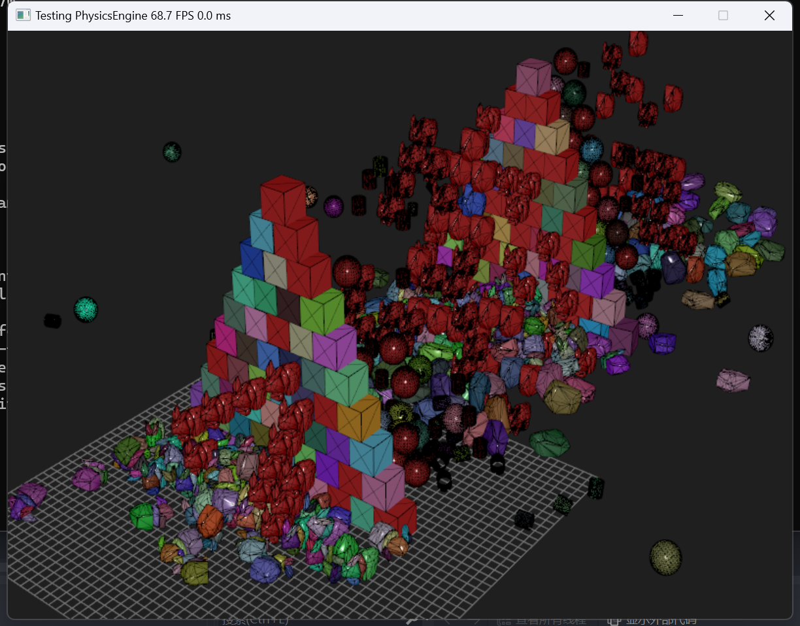
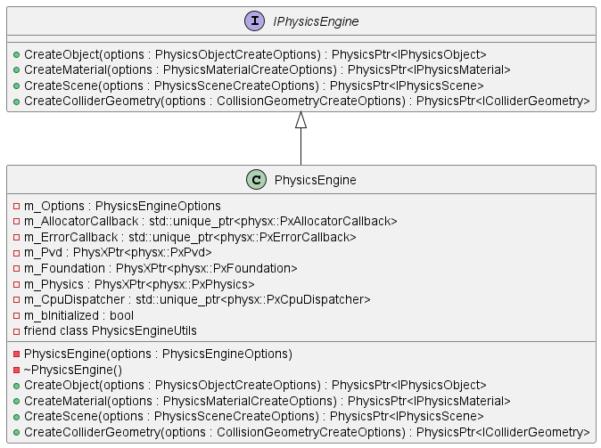
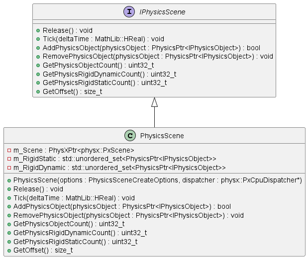
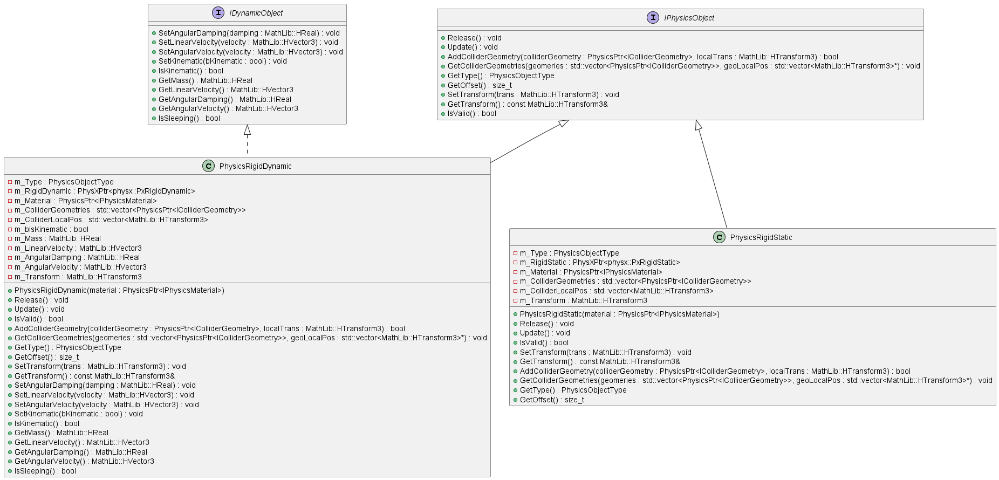
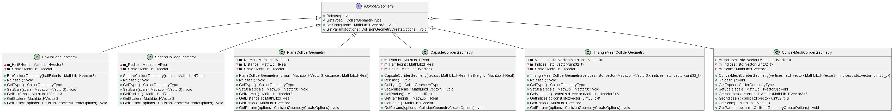
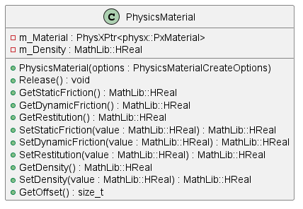
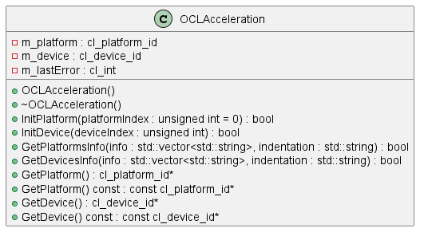
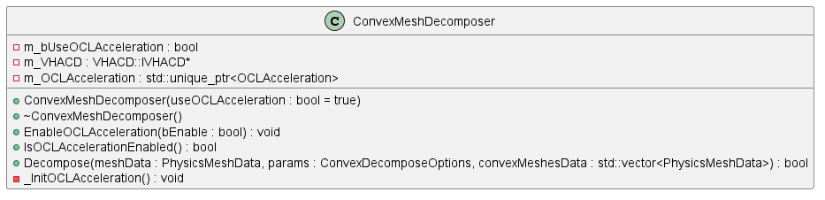

# PhysX Toy

PhysX Toy 是一个基于 PhysX 的物理引擎的小玩具，用于学习物理引擎的基本使用,渲染使用 Magnum 实现

## 环境配置

### 步骤 1：下载并安装 vcpkg

在命令行中执行以下命令：

```bash
git clone https://github.com/microsoft/vcpkg.git
```

### 步骤 2：安装 glm、glew、freeglut、physx、Eigen3、OpenCL、tinyobjloader、Magnum

在命令行中执行以下命令：

```bash
vcpkg install glm
vcpkg install glew
vcpkg install freeglut
vcpkg install physx
vcpkg install Eigen3
vcpkg install OpenCL
vcpkg install tinyobjloader
vcpkg install Magnum
```

## 运行结果



## 类图

<details>
  <summary>PhysicsEngine</summary>
  <br>



</details>

<details>
      <summary>PhysicsScene</summary>
  <br>



</details>

<details>
      <summary>PhysicsObject</summary>
  <br>



</details>

<details>
      <summary>ColliderGeometry</summary>
  <br>



</details>

<details>
      <summary>PhysicsMaterial</summary>
  <br>



</details>

<details>
      <summary>OCLAcceleration</summary>
  <br>



<details>
      <summary>ConvexMeshDecomposer</summary>
  <br>



</details>
