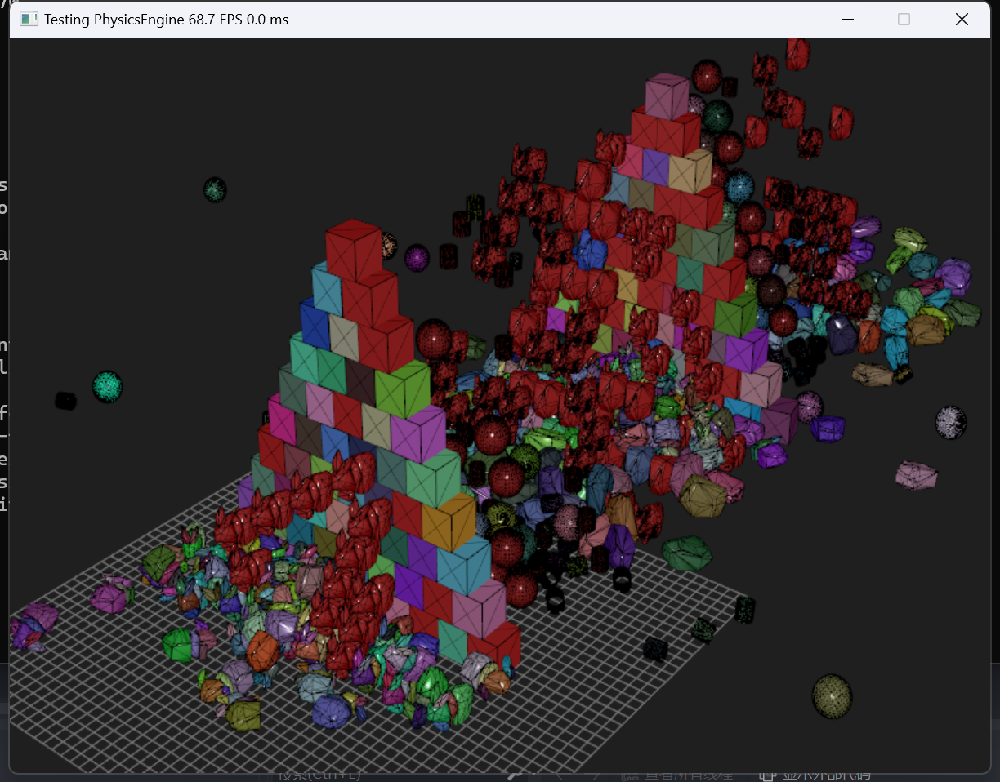
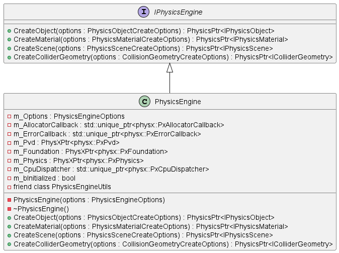
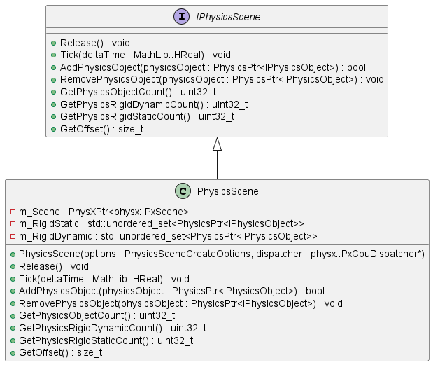
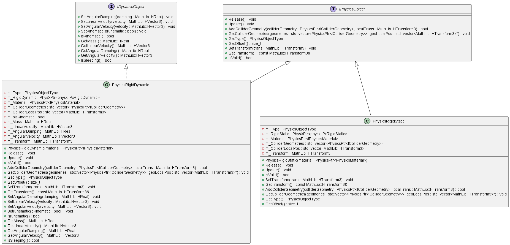
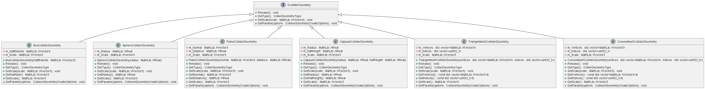
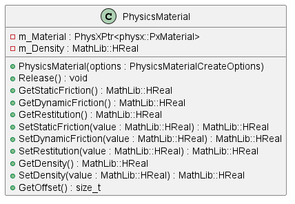
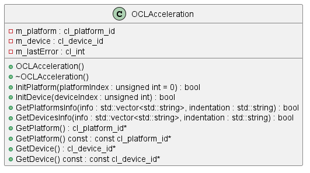
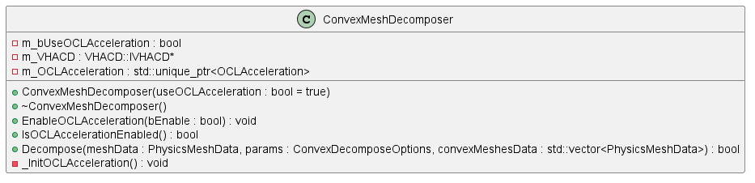

# PhysX Toy

PhysX Toy 是一个基于 NVIDIA PhysX 的物理引擎学习项目，提供了各种物理模拟功能和可视化界面。本项目旨在帮助学习物理引擎的基本使用。

## 项目特点

- 基于 PhysX 物理引擎构建的物理模拟系统
- 支持刚体物理、碰撞检测和求解
- 集成 V-HACD 算法进行凸包分解
- 使用 OpenCL 加速计算
- 支持物理场景渲染和交互
- 包含多种几何体的物理模拟

## 环境配置

### 步骤 1：下载并安装 vcpkg

在命令行中执行以下命令：

```bash
git clone https://github.com/microsoft/vcpkg.git
cd vcpkg
bootstrap-vcpkg.bat  # Windows
./bootstrap-vcpkg.sh  # Linux/MacOS
```

### 步骤 2：安装依赖库

在命令行中执行以下命令安装所需的库：

```bash
vcpkg install glm
vcpkg install glew
vcpkg install freeglut
vcpkg install physx
vcpkg install Eigen3
vcpkg install OpenCL
vcpkg install tinyobjloader
vcpkg install glfw3
vcpkg install imgui
vcpkg install Jolt
```

### 步骤 3：克隆项目

```bash
git clone https://github.com/hgl-pong/PhysXToy.git
cd PhysXToy
git submodule update --init --recursive
git submodule update --recursive --remote
```

### 步骤 4：构建项目

使用 CMake 构建项目：

```bash
mkdir build
cd build
cmake ..
cmake --build . --config Release
```

编译成功后，可执行文件将生成在 `executable/Release` 目录下。

## 项目结构

- `include/` - 项目头文件
  - `Physics/` - 物理引擎相关头文件
  - `Renderer/` - 渲染器相关头文件
- `src/` - 源代码文件
  - `Physics/` - 物理引擎实现
  - `Render/` - 渲染器实现
- `ThirdParty/` - 第三方库
- `asset/` - 模型和贴图资源
- `img/` - 项目文档图片

## 运行结果



## 类图

<details>
  <summary>PhysicsEngine</summary>
  <br>



</details>

<details>
      <summary>PhysicsScene</summary>
  <br>



</details>

<details>
      <summary>PhysicsObject</summary>
  <br>



</details>

<details>
      <summary>ColliderGeometry</summary>
  <br>



</details>

<details>
      <summary>PhysicsMaterial</summary>
  <br>



</details>

<details>
      <summary>OCLAcceleration</summary>
  <br>



</details>

<details>
      <summary>ConvexMeshDecomposer</summary>
  <br>



</details>

## 功能特性

- 刚体物理模拟
- 粒子系统模拟
- 碰撞检测与响应
- 多种几何体支持 (盒体、球体、胶囊体等)
- 基于凸包分解的复杂碰撞检测
- 物理约束及关节系统
- 使用 OpenCL 进行物理计算加速

## 贡献指南

欢迎提交问题报告和功能请求。如果您想贡献代码，请遵循以下步骤：

1. Fork 项目
2. 创建您的特性分支 (`git checkout -b feature/AmazingFeature`)
3. 提交您的更改 (`git commit -m 'Add some AmazingFeature'`)
4. 推送到分支 (`git push origin feature/AmazingFeature`)
5. 打开一个 Pull Request